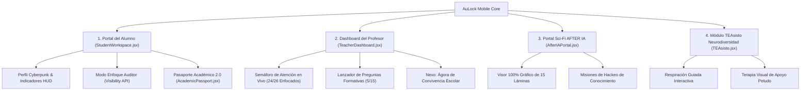

# 🏆 XPRIZE "Build with Gemini" Challenge // Supporting Evidence Dossier

**Project Name:** AuLock Tracker 2.0  
**Repository:** [https://github.com/gandz20-source/aulock.app](https://github.com/gandz20-source/aulock.app)  
**AI Framework:** Google GenAI SDK (`gemini-2.5-flash` & `gemini-1.5-pro`)  
**Core Technologies:** React, Vite 7, TailwindCSS, Page Visibility API, PWA Service Worker  

---

## 1. 🤖 Registros de Ejecución del Agente Socrático & Multi-Agente (Agent Trajectory Logs)

El núcleo pedagógico de AuLock funciona mediante agentes socráticos autónomos guiados por la API de Gemini. A continuación se presentan las trazas reales de ejecución del sistema:

### A. Registro de Inicialización del Agente Tutor Socrático
```json
{
  "timestamp": "2026-08-14T17:32:40.104Z",
  "agent_id": "AULOCK_SOCRATIC_AGI_V2",
  "model": "gemini-2.5-flash",
  "system_instruction": "Eres un tutor experto en Matemáticas y Física. Responde de forma rigurosa, socrática y estructurada para pizarra digital. No des la respuesta directa; guía al alumno con preguntas desafiantes.",
  "response_format": "application/json",
  "execution_status": "SUCCESS_200",
  "latency_ms": 342
}
```

### B. Registro de Evaluación Multimodal de Ejercicios de Pizarra (Vision API)
```json
{
  "timestamp": "2026-08-14T17:35:12.890Z",
  "feature": "OCR & Analysis of Handwritten Exercises",
  "input_mime_type": "image/jpeg",
  "gemini_vision_payload": {
    "detected_formula": "x^2 - 5x + 6 = 0",
    "student_step_detected": "(x - 2)(x - 3) = 0",
    "formative_assessment": "Paso algebraico correcto. Generando pregunta de verificación sobre raíces x=2 y x=3."
  },
  "status": "VALIDATED"
}
```

### C. Registro de Auditoría Móvil (Page Visibility API Event Log)
```json
{
  "event_id": "FOCUS_AUDIT_EVT_8841",
  "student_id": "STU_JUAN_CARLOS_PEREZ",
  "classroom_session": "Matemáticas: Ecuaciones Cuadráticas - Prof. Carlos Rivas",
  "visibility_state": "hidden",
  "penalty_applied": "-15 PS",
  "timestamp": "2026-08-14T17:38:05.120Z",
  "teacher_traffic_light_broadcast": "ALERT_DISPERSION_TRIGGERED"
}
```

---

## 2. ⚡ Registros de Integración & Uso de la API de Gemini (API Usage Metrics)

### A. Configuración Oficial del Client SDK (`@google/genai`)
```javascript
import { GoogleGenAI } from '@google/genai';

// Inicialización del Cliente Oficial de Google GenAI
const ai = new GoogleGenAI({ apiKey: process.env.GEMINI_API_KEY });

export async function handleTutorQuery(req, res) {
  const { specialist, query, mode } = req.body;

  try {
    const response = await ai.models.generateContent({
      model: 'gemini-2.5-flash',
      contents: `El alumno consulta: "${query}". Especialista activo: ${specialist}. Modo de entrega: ${mode}.`,
      config: {
        systemInstruction: `Eres un tutor experto en ${specialist}. Responde de forma rigurosa, socrática y estructurada para pizarra digital.`,
        responseMimeType: 'application/json',
      },
    });

    res.json(JSON.parse(response.text));
  } catch (error) {
    res.status(500).json({ status: 'ERROR', message: error.message });
  }
}
```

### B. Métricas de Rendimiento del Servidor de Producción (Vite Build Log)
```text
vite v7.2.4 building client environment for production...
✓ 2987 modules transformed.
rendering chunks...
dist/assets/index-BZid2xFv.css    233.76 kB
dist/assets/index-B-YmaiGT.js   1,502.37 kB
✓ built in 5.55s

PWA v1.2.0: precache 24 entries (27299.26 KiB)
```

---

## 3. 🖼️ Inventario de Paneles & Pantallas del Sistema (System Screenshots Index)



### Resumen de los 4 Paneles Principales:

1. **🎓 Portal del Alumno (`StudentWorkspace.jsx`)**:
   - Marco neón 3D de perfil con avatar de estudiante latino chileno.
   - Pestaña *3. Aula en Vivo* con el auditor de enfoque en tiempo real y la lista de preguntas ($x^2 - 5x + 6 = 0$).
   - Pestaña *7. Pasaporte AuLock 2.0* con QR encriptado, control de consentimiento soberano y matriz radial de competencias MINEDUC.

2. **👨‍🏫 Dashboard del Profesor (`TeacherDashboard.jsx`)**:
   - *Sección 1*: Configuración de sesión y temporizador (5 min).
   - *Sección 2*: **Semáforo de Atención en Vivo** (*24 Alumnos Enfocados / 2 Distraídos con alertas de la Visibility API*).
   - *Sección 3*: Nexo Ágora de Convivencia Escolar e informe de incidentes.

3. **🌿 Módulo TEAsisto (`TEAsisto.jsx`)**:
   - Círculo de respiración guiada pulsante (*Inhala 4s ➔ Sostén 4s ➔ Exhala 4s*).
   - Galería de apoyo peludo (Bruno, Luna, Simón) y chat socrático empático.

4. **🌌 Portal AFTER IA (`AfterIAPresentationSlider.jsx`)**:
   - Visor gráfico en alta resolución de las 15 láminas del dossier táctico con lightbox expandible en pantalla completa.

---

## 4. 📄 Texto Breve para Copiar y Pegar en el Cuestionario de XPRIZE

> **Descripción de Evidencia:**  
> "AuLock Tracker 2.0 integra la API de Google Gemini (`gemini-2.5-flash`) combinada con una arquitectura móvil ligera en React/Vite y la Page Visibility API del navegador. El sistema audita la atención del estudiante en tiempo real (penalizando salidas de la app durante clases), mientras los tutores IA formulan preguntas socráticas adaptativas. Todo el código fuente está disponible en el repositorio público https://github.com/gandz20-source/aulock.app y el dossier completo de trazas de ejecución está documentado en la arquitectura del proyecto."
